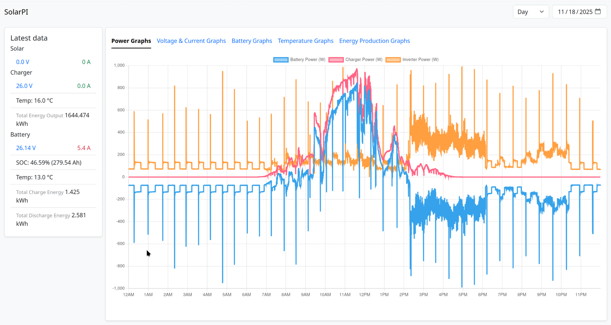

# SolarPI

Solarpi is a simple python app to do datalogging of the junctec battery monitor and helios solar chargers via bluetooth.

It's made for a raspberry pi should will work on any debian based system.



To view live data using an android phone see [https://github.com/codelv/solar](solar).

### About

The app is split into two services, `solarpi-monitor` and `solarpi-web`. 

The `solarpi-monitor` service connects to the battery monitor and charger via bluetooth, pulls/decodes the data, 
and saves it into an sqlite db.

The `solarpi-web` service provides a simple web application to view the data in the database.

## Install

Download the latest release and run:

```bash
sudo apt install ./solarpi-v1.0.0.deb
```

## Usage

Go to the ip or hostname of the pi in your browser and you should see the web page. 

If you see a 502 Bad gateway page make sure the solarpi-web service is up and running. 


### Logs

Check logs using `journalctl -f -u solarpi-web.service` and `journalctl -f -u solarpi-monitor.service`.

### Restart/stop/start

You can stop, start, or restart the service(s) using.

`sudo system solarpi-web restsart`

### DB backup/restore

The database is located at `/opt/solar-pi/solarpi.db`. You can simply copy this
file to back it up and replace it (stop the services first) to restore a backup.


## Troubleshooting

It appears the raspberry pi has bad RF coexistence with when using BT and wifi. 

I had lots of connectivity issues with a raspberry pi zero 2 w. After switching
to a raspberry pi 3 and using ethernet instead of wifi the bluetooth connectivity
problems have gone away and bluetooth updates much more rapidly.
